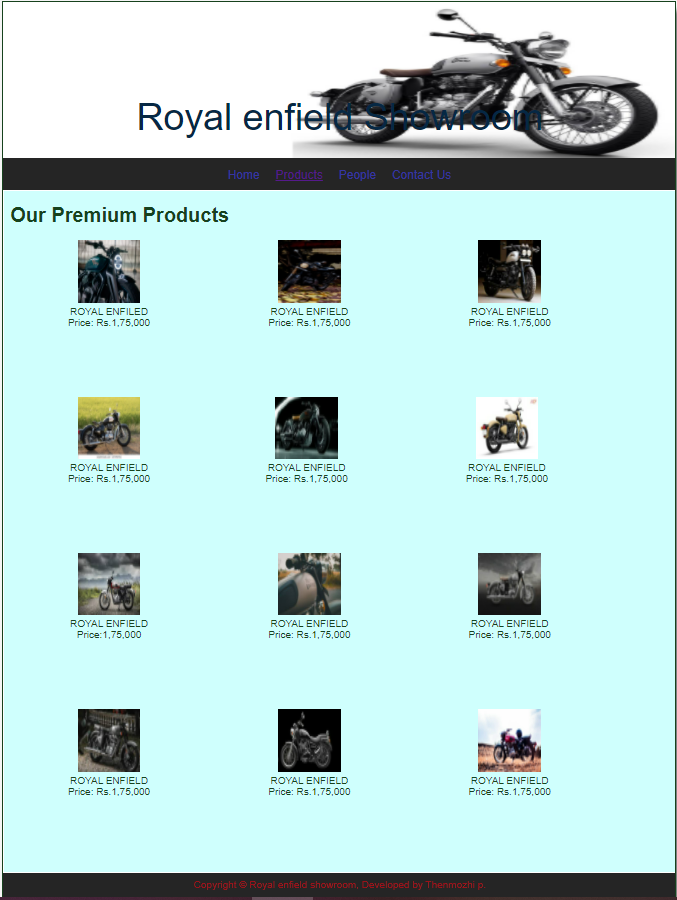
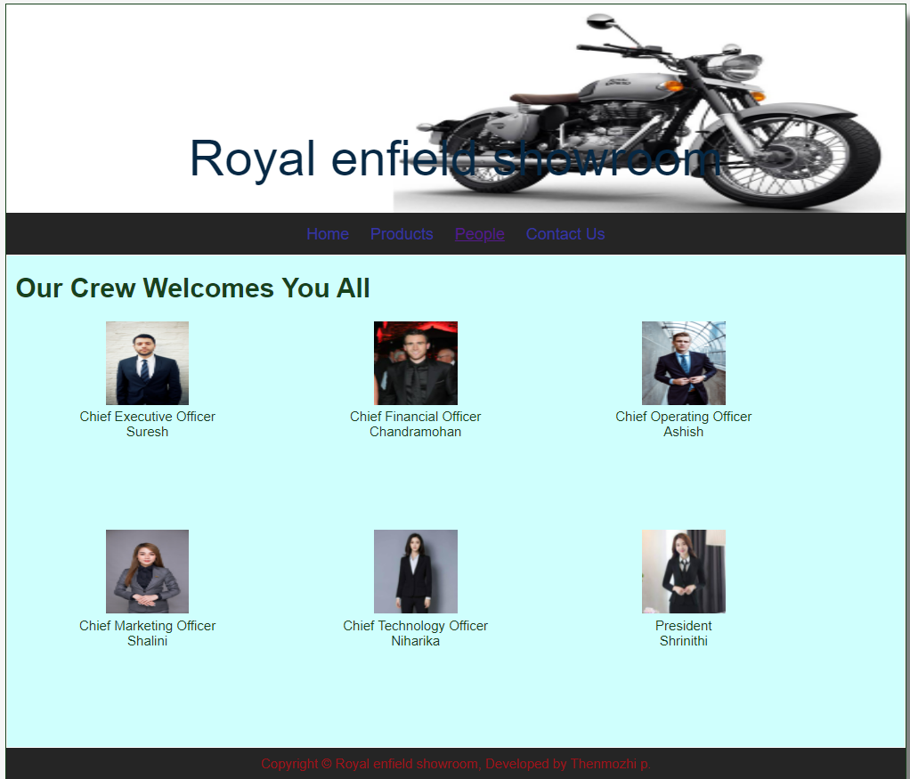
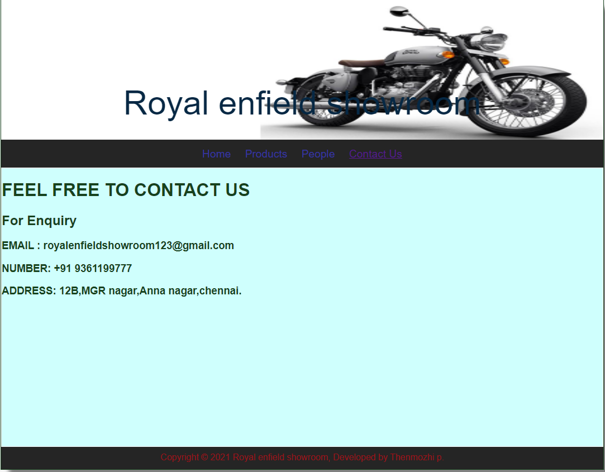

# Web Design for a Software Product Company

## AIM:

To design a static website for a software product company company.

## DESIGN STEPS:

### Step 1:

Requirement collection.

### Step 2:

Creating the layout using HTML and CSS.

### Step 3:

Updating the sample content.

### Step 4:

Choose the appropriate style and color scheme.

### Step 5:

Validate the layout in various browsers.

### Step 6:

Validate the HTML code.

### Step 6:

Publish the website in the given URL.

## PROGRAM :
### PROGRAM 1:
```
<!DOCTYPE html>
<html lang="en">
  <head>
    <title>Royal Enfield Showroom</title>
    <link rel="stylesheet" href="./css/layout.css" />
    <link rel="icon" href="./img/icon.png" type="image/x-icon" />
  </head>

  <body>
    <div class="container">
      <div class="banner">Royal Enfield Showroom.</div>
      <div class="menu">
        <div class="menuitemselected"><a href="/static/home.html">Home</a></div>
        <div class="menuitem"><a href="/static/products.html">Products</a></div>
        <div class="menuitem"><a href="/static/people.html">People</a></div>
        <div class="menuitem"><a href="/static/contact us.html">Contact Us</a></div>
      </div>
      <div class="content">
        <div class="homecontent">
          <h1>About Us</h1>
          
          <div class="contenttext">
            A Royal Enfield gets that old-world charm with its retro-styled 
            looks and a thumpy single-cylinder motor to boot. With its 
            curvaceous nature, chrome fittings, hand-painted fuel tank,
             the Royal Enfield is in every sense of the word, retro.
            <br />
            Royal Enfield offers 6 new models in India with most popular 
            bikes being Classic 350, Bullet 350 and Meteor 350. The 
            upcoming bikes of Royal Enfield include Scram 411, Super 
            Meteor 650 and Shotgun 650. Most expensive Royal Enfield 
            bike is Continental GT 650, which is priced at Rs. 2,97,003.
            <ul>
              <li>made like a gun,goes like a bullets</li>
              <li>if you never ride a bullet then you will be never be royal</li>
              <li>work hard with silence let your"bullet"make all the noise!</li>
            </ul>
          </div>
        </div>
      </div>
      <div class="footer">
        Copyright &#169; 2021 Royal Enfield Showroom, Developed by Thenmozhi P.
      </div>
    </div>
  </body>
</html>
```

### program 2 :
```
<!DOCTYPE html>
<html lang="en">
  <head>
    <title>Royal Enfield Showroom</title>
    <link rel="stylesheet" href="./css/layout.css" />
    <link rel="icon" href="./img/icon.png" type="image/x-icon" />
  </head>

  <body>
    <div class="container">
      <div class="banner">Royal enfield Showroom</div>
      <div class="menu">
        <div class="menuitem"><a href="/static/home.html">Home</a></div>
        <div class="menuitemselected">
          <a href="/static/products.html">Products</a>
        </div>
        <div class="menuitem"><a href="/static/people.html">People</a></div>
        <div class="menuitem"><a href="/static/contact us.html">Contact Us</a></div>
      </div>
      <div class="content">
        <div class="productcontent">    
          <h1>Our Premium Products</h1>
          <div class="productitems">
              <div class="productitem"> 
                  <div class="itemimage">
                  
                  </div>
                  <div class="itemname">ROYAL ENFILED</div>
                  <div class="itemprice">Price: Rs.1,75,000 </div>
              </div>
              <div class="productitem"> 
                  <div class="itemimage">
                  
                  </div>
                  <div class="itemname">ROYAL ENFIELD</div>
                  <div class="itemprice">Price: Rs.1,75,000</div>
              </div>
              <div class="productitem"> 
                <div class="itemimage">
                
                </div>
                <div class="itemname">ROYAL ENFIELD</div>
                <div class="itemprice">Price: Rs.1,75,000 </div>
              </div>
              <div class="productitem"> 
                <div class="itemimage">
                
                </div>
                <div class="itemname">ROYAL ENFIELD</div>
                <div class="itemprice">Price: Rs.1,75,000 </div>
              </div><div class="productitem"> 
                  <div class="itemimage">
                  
                  </div>
                  <div class="itemname">ROYAL ENFIELD</div>
                  <div class="itemprice">Price: Rs.1,75,000 </div>
              </div>
              <div class="productitem"> 
                <div class="itemimage">
                
                </div>
                <div class="itemname">ROYAL ENFIELD</div>
                <div class="itemprice">Price: Rs.1,75,000 </div>
              </div>
              <div class="productitem"> 
                <div class="itemimage">
                
                </div>
                <div class="itemname">ROYAL ENFIELD</div>
                <div class="itemprice">Price:1,75,000 </div>
              </div>
              <div class="productitem"> 
                <div class="itemimage">
                
                </div>
                <div class="itemname">ROYAL ENFIELD</div>
                <div class="itemprice">Price: Rs.1,75,000 </div>
              </div>
              <div class="productitem"> 
                <div class="itemimage">
                
                </div>
                <div class="itemname">ROYAL ENFIELD</div>
                <div class="itemprice">Price: Rs.1,75,000 </div>
              </div>
              <div class="productitem"> 
                <div class="itemimage">
                
                </div>
                <div class="itemname">ROYAL ENFIELD</div>
                <div class="itemprice">Price: Rs.1,75,000 </div>
              </div>
              <div class="productitem"> 
                <div class="itemimage">
                
                </div>
                <div class="itemname">ROYAL ENFIELD</div>
                <div class="itemprice">Price: Rs.1,75,000 </div>
              </div>
              <div class="productitem"> 
                <div class="itemimage">
                
                </div>
                <div class="itemname">ROYAL ENFIELD</div>
                <div class="itemprice">Price: Rs.1,75,000 </div>
             </div>
          </div>
          </div>        
      </div>
      <div class="footer">
        Copyright &#169; Royal enfield showroom, Developed by Thenmozhi p.
      </div>
    </div>
  </body>
</html>
```
### Program3:
```
<!DOCTYPE html>
<html lang="en">
    <head>
        <title>Royal enfield showroom</title>
        <link rel="stylesheet" href="./css/layout.css" />
        <link rel="icon" href="./img/icon.png" type="image/x-icon" />
    </head>
    <body>
        <div class="container">
            <div class="banner">Royal enfield showroom</div>
            <div class="menu">
                <div class="menuitem"><a href="/static/home.html">Home</a></div>
                <div class="menuitem"><a href="/static/products.html">Products</a></div>
                <div class="menuitemselected"><a href='/static/people.html'>People</a></div>
                <div class="menuitem"><a href='/static/contact us.html'>Contact Us</a></div>
            </div>
            <div class="content">
                <div class="productcontent">
                    <h1>Our Crew Welcomes You All</h1>
                    <div class="productitems">
                        <div class="productitem">
                            <div class="itemimage">
                                
                            </div>
                            <div class="itemname">Chief Executive Officer</div>
                            <div class="itemprice">Suresh</div>
                        </div>
                        <div class="productitem">
                            <div class="itemimage">
                                
                            </div>
                            <div class="itemname">Chief Financial Officer</div>
                            <div class="itemprice">Chandramohan</div>
                        </div>
                        <div class="productitem">
                            <div class="itemimage">
                                
                            </div>
                            <div class="itemname">Chief Operating Officer</div>
                            <div class="itemprice">Ashish</div>
                        </div>
                        <div class="productitem">
                            <div class="itemimage">
                                
                            </div>
                            <div class="itemname">Chief Marketing Officer</div>
                            <div class="itemprice">Shalini</div>
                        </div>
                        <div class="productitem">
                            <div class="itemimage">
                                
                            </div>
                            <div class="itemname">Chief Technology Officer</div>
                            <div class="itemprice">Niharika</div>
                        </div>
                        <div class="productitem">
                            <div class="itemimage">
                                
                            </div>
                            <div class="itemname">President</div>
                            <div class="itemprice">Shrinithi</div>
                        </div>
                    </div>
                </div>
            </div>
            <div class="footer">
                Copyright &#169; Royal enfield showroom, Developed by Thenmozhi p.
            </div>
        </div>
    </body>
</html>
```
### Program4:
```
<!DOCTYPE html>
<html lang="en">
    <head>
        <title>Royal enflied showroom</title>
        <link rel="stylesheet" href="./css/layout.css" />
        <link rel="icon" href="./img/icon.png" type="image/x-icon" />
    </head>

    <body>
        <div class="container">
            <div class="banner">Royal enfield showroom</div>
            <div class="menu">
                <div class="menuitem"><a href="/static/home.html">Home</a></div>
                <div class="menuitem"><a href="/static/products.html">Products</a></div>
                <div class="menuitem"><a href='/static/people.html'>People</a></div>
                <div class="menuitemselected"><a href='/static/contact us.html'>Contact Us</a></div>
            </div>
            <div class="content">
                <div class="Peoplecontent">
                    <h1>FEEL FREE TO CONTACT US</h1> 
                    <div class="Peopleitems">
                        <h2>For Enquiry</h2>
                        <h3>EMAIL : royalenfieldshowroom123@gmail.com</h3>
                        <h3>NUMBER: +91 9361199777</h3>
                        <h3>ADDRESS: 12B,MGR nagar,Anna nagar,chennai.</h3>
                    </div>
                </div>
            </div>
            <div class="footer">
            Copyright &#169; 2021 Royal enfield showroom, Developed by Thenmozhi p.
            </div>
        </div>
    </body>
</html>
```
### Layout Program:
```
* {
  box-sizing: border-box;
  font-family: Arial, Helvetica, sans-serif;
}
body {
  background-color: whitesmoke;
  color: #17421d;
}
.container {
  width: 1080px;
  margin-left: auto;
  margin-right: auto;
  border-width: 1px 1px 1px 1px;
  border-style: solid;
  box-shadow: 15px 15px 8px gray;
}

.banner {
  display: block;
  width: 100%;
  height: 250px;
  text-align: center;
  font-size: 60px;
  background-image: url("/static/img/background.png");
  background-size: 100% 100%;
  margin: 0px 0px 0px 0px;
  padding-top: 150px;
  color: #062844;
}

.menu {
  display: block;
  width: 100%;
  height: 50px;
  font-size: larger;
  background-color: #252525;
  text-align: center;
  padding-top: 15px;
  margin: 0px 0px 0px 0px;
  border-width: 1px;
}

.menuitem {
  display: inline-block;
  margin-left: 10px;
  margin-right: 10px;
}
.menuitemselected {
  display: inline-block;
  margin-left: 10px;
  margin-right: 10px;
  color: #320e50;
}

.menuitem a {
  text-decoration: none;
  color: #3736a1;
}

.content {
  display: block;
  width: 100%;
  background-color: #cffffd;
  min-height: 500px;
  margin: 0px 0px 0px 0px;
  border-width: 1px;
  border-color: white;
  border-style: solid;
}
.homecontent {
  min-height: 500px;
  margin: 10px 10px 10px 10px;
}
.homecontent h1 {
  text-align: left;
}
.homecontent img {
  float: right;
  width: 400px;
  height: 300px;
  margin-left: 10px;
}

.contenttext {
  text-align: justify;
}

.productcontent {
  min-height: 500px;
  margin: 10px 10px 10px 10px;
}

.productcontent h1 {
  text-align: left;
}

.productitems {
  display: block;
}

.productitem {
  display: inline-block;
  width: 30%;
  height: 250px;
  text-align: center;
}

.productitem img {
  width: 100px;
  height: 100px;
  display: block;
}
.productitem .itemimage {
  display: block;
  margin-left: auto;
  margin-right: auto;
  width: 100px;
  margin-bottom: 5px;
}

.productitem .itemname {
  display: block;
}
.productitem .itemprice {
  display: block;
}

.footer {
  display: block;
  width: 100%;
  height: 40px;
  background-color: #252525;
  text-align: center;
  padding-top: 10px;
  margin: 0px 0px 0px 0px;
  color: #9c1018;
}
```

## OUTPUT:


### Home Page:


### product:

### People:

### Contact:


## Result:

Thus a website is designed for the software product company and the HTML,CSS code are validated.
